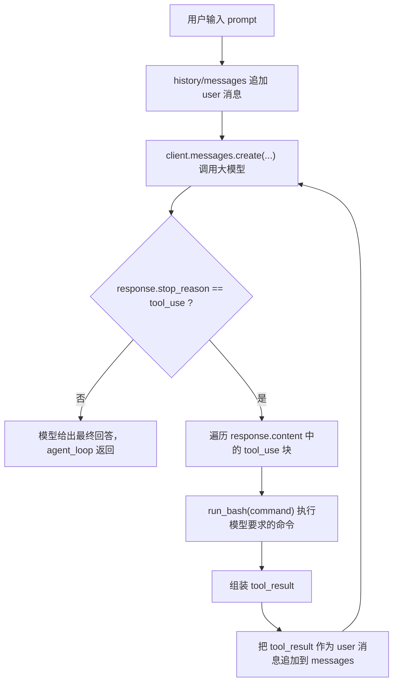
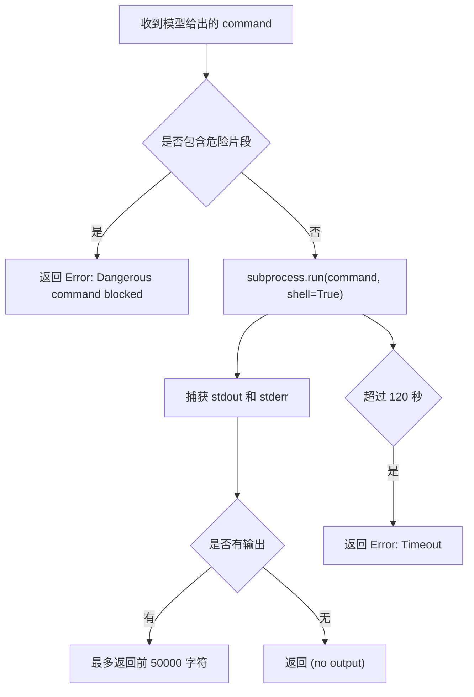
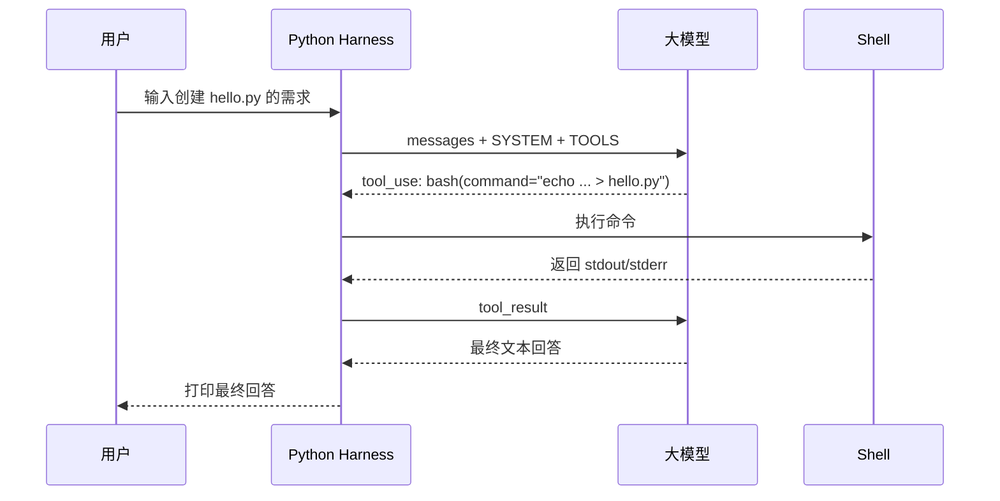

# s01 Agent Loop 学习笔记

> 章节位置：`s01_agent_loop/`
>
> 核心结论：一个工具加一个循环，就能得到最小可运行的 Agent Harness。模型负责判断下一步，代码负责执行工具并把结果喂回模型。

## 1. 这一章到底在讲什么

README 的一句话是：

```text
One loop & Bash is all you need
一个工具 + 一个循环 = 一个 Agent
```

这里的重点不是让模型“变聪明”，而是给模型一个可以行动的环境：

```text
用户提问
  -> 大模型判断要不要调用工具
  -> 如果要调用 bash，就由 Python 真的执行命令
  -> 把命令输出作为 tool_result 再发回大模型
  -> 大模型继续判断
  -> 直到大模型不再调用工具
```

这就是 README 里说的 Harness 层。模型本身不会真的读文件、跑命令、看终端输出；这些都由外层代码代劳。

## 2. 原始流程图

仓库自带的图在这里：


如果你的 Markdown 查看器不能显示上面的 SVG，可以看下面这个 Mermaid 版本。



## 3. 运行入口：用户输入如何进入循环

代码入口在 `code.py` 第 117 到 137 行：

```python
if __name__ == "__main__":
    history = []
    while True:
        query = input("\033[36ms01 >> \033[0m")
        if query.strip().lower() in ("q", "exit", ""):
            break
        history.append({"role": "user", "content": query})
        agent_loop(history)
```

运行：

```bat
cd /d D:\1_强生\git\learn-claude-code
python s01_agent_loop/code.py
```

你输入一句话，例如：

```text
List all Python files in this directory
```

程序会把它包装成一条消息：

```python
{"role": "user", "content": "List all Python files in this directory"}
```

然后放进 `history`，再交给 `agent_loop(history)`。

这里的 `history` 就是对话历史，也就是 README 里的 `messages[]`。后面每次模型回答、工具结果都会继续追加进去。

## 4. 配置读取：为什么能用智谱 API

相关代码在第 43 到 52 行：

```python
from anthropic import Anthropic
from dotenv import load_dotenv

load_dotenv(override=True)

if os.getenv("ANTHROPIC_BASE_URL"):
    os.environ.pop("ANTHROPIC_AUTH_TOKEN", None)

client = Anthropic(base_url=os.getenv("ANTHROPIC_BASE_URL"))
MODEL = os.environ["MODEL_ID"]
```

这几行做了四件事：

| 代码 | 作用 |
|---|---|
| `load_dotenv(override=True)` | 读取项目根目录的 `.env` 文件 |
| `ANTHROPIC_BASE_URL` | 如果配置了，就使用兼容 Anthropic 协议的第三方接口 |
| `Anthropic(base_url=...)` | 创建 SDK 客户端 |
| `MODEL = os.environ["MODEL_ID"]` | 从环境变量读取模型名 |

你当前使用智谱，所以 `.env` 应该是这种结构：

```env
ANTHROPIC_API_KEY=你的智谱 API Key
ANTHROPIC_BASE_URL=https://open.bigmodel.cn/api/anthropic
MODEL_ID=glm-5
```

虽然变量名叫 `ANTHROPIC_API_KEY`，但在这个项目里它只是 SDK 默认读取的 Key 名。因为你配置了 `ANTHROPIC_BASE_URL`，请求会发到智谱的 Anthropic 兼容接口，而不是默认 Anthropic 地址。

## 5. System Prompt：模型被设定成 coding agent

第 54 行：

```python
SYSTEM = f"You are a coding agent at {os.getcwd()}. Use bash to solve tasks. Act, don't explain."
```

这句话给模型三个约束：

| 片段 | 含义 |
|---|---|
| `You are a coding agent` | 你是一个编程 Agent |
| `at {os.getcwd()}` | 当前工作目录是程序启动时所在目录 |
| `Use bash to solve tasks` | 解决任务时可以使用 bash 工具 |
| `Act, don't explain` | 尽量行动，而不是只解释 |

注意：这里说的是 `bash`，但你在 Windows 上运行时，`subprocess.run(..., shell=True)` 实际会走 Windows shell。教学代码为了简洁没有做跨平台工具命名区分。

## 6. 工具定义：把 bash 告诉大模型

第 56 到 65 行：

```python
TOOLS = [{
    "name": "bash",
    "description": "Run a shell command.",
    "input_schema": {
        "type": "object",
        "properties": {"command": {"type": "string"}},
        "required": ["command"],
    },
}]
```

这段不是在执行命令，而是在告诉大模型：

```text
你可以使用一个名为 bash 的工具。
这个工具需要一个参数 command。
command 必须是字符串。
```

大模型看到这个 schema 后，如果它判断需要查目录、创建文件、运行脚本，就可能返回一个 `tool_use` 块，例如概念上类似：

```json
{
  "type": "tool_use",
  "id": "toolu_xxx",
  "name": "bash",
  "input": {
    "command": "dir"
  }
}
```

重点：模型不会自己执行 `dir`。它只是返回“我想调用 bash，参数是 dir”。真正执行发生在 Python 的 `run_bash()`。

## 7. 大模型调用：最关键的地方

最关键代码在第 85 到 90 行：

```python
def agent_loop(messages: list):
    while True:
        response = client.messages.create(
            model=MODEL, system=SYSTEM, messages=messages,
            tools=TOOLS, max_tokens=8000,
        )
```

这就是调用大模型的地方。

可以把它理解成一次 HTTP API 请求。SDK 帮你把 Python 参数转换成请求，发给 `.env` 指定的接口。

### 7.1 请求里发了什么

| 参数 | 值来自哪里 | 作用 |
|---|---|---|
| `model=MODEL` | `.env` 里的 `MODEL_ID` | 指定调用哪个模型，例如 `glm-5` |
| `system=SYSTEM` | 第 54 行 | 给模型设定身份和行为规则 |
| `messages=messages` | 当前对话历史 | 告诉模型目前发生了什么 |
| `tools=TOOLS` | 第 56 到 65 行 | 告诉模型可以调用哪些工具 |
| `max_tokens=8000` | 代码写死 | 限制模型本次最多输出多少 token |

### 7.2 第一次调用时 messages 可能长这样

```python
[
    {
        "role": "user",
        "content": "List all Python files in this directory"
    }
]
```

模型读到用户问题，又看到自己有 `bash` 工具，于是可能返回：

```text
stop_reason = "tool_use"
content = [
  tool_use(name="bash", input={"command": "dir /s /b *.py"})
]
```

### 7.3 第二次调用时 messages 会变长

执行完工具后，代码会把工具结果追加进去。第二次请求时，`messages` 概念上会变成：

```python
[
    {
        "role": "user",
        "content": "List all Python files in this directory"
    },
    {
        "role": "assistant",
        "content": [模型返回的 tool_use 块]
    },
    {
        "role": "user",
        "content": [
            {
                "type": "tool_result",
                "tool_use_id": "toolu_xxx",
                "content": "s01_agent_loop\\code.py\ns02_tool_use\\code.py\n..."
            }
        ]
    }
]
```

这一步非常重要：工具结果是以 `user` 角色追加回去的，但内容类型是 `tool_result`。`tool_use_id` 用来告诉模型：这个结果对应刚才哪一次工具调用。

## 8. stop_reason：循环继续还是结束

第 92 到 97 行：

```python
messages.append({"role": "assistant", "content": response.content})

if response.stop_reason != "tool_use":
    return
```

这里是整个 Agent Loop 的分叉点：

| `response.stop_reason` | 意味着什么 | 程序动作 |
|---|---|---|
| `"tool_use"` | 模型要调用工具 | 继续往下执行工具 |
| 不是 `"tool_use"` | 模型不需要工具了 | `return` 退出循环 |

README 里强调的就是这个信号：

```text
模型调用工具就继续，不调用就停。
```

教学版为了清楚，直接看 `stop_reason`。README 的“深入 CC 源码”也提到，生产版 Claude Code 因为使用流式响应，不完全依赖 `stop_reason`，而是检查内容里有没有 `tool_use` 块。这是生产级可靠性处理，s01 先不展开。

## 9. 工具执行：模型的命令如何真的跑起来

工具执行函数在第 69 到 81 行：

```python
def run_bash(command: str) -> str:
    dangerous = ["rm -rf /", "sudo", "shutdown", "reboot", "> /dev/"]
    if any(d in command for d in dangerous):
        return "Error: Dangerous command blocked"
    try:
        r = subprocess.run(command, shell=True, cwd=os.getcwd(),
                           capture_output=True, text=True, timeout=120)
        out = (r.stdout + r.stderr).strip()
        return out[:50000] if out else "(no output)"
    except subprocess.TimeoutExpired:
        return "Error: Timeout (120s)"
    except (FileNotFoundError, OSError) as e:
        return f"Error: {e}"
```

执行流程：



关键参数解释：

| 参数 | 作用 |
|---|---|
| `shell=True` | 允许执行字符串形式的 shell 命令 |
| `cwd=os.getcwd()` | 命令在当前工作目录执行 |
| `capture_output=True` | 捕获命令输出，而不是直接丢到屏幕 |
| `text=True` | 输出按文本处理 |
| `timeout=120` | 最多运行 120 秒 |

这段代码是教学版，只有很粗的危险命令拦截。README 也提醒：s03 才会讲真正的权限系统。所以 s01 适合在临时目录里测试。

## 10. tool_result：把真实世界的结果喂回模型

第 99 到 113 行：

```python
results = []
for block in response.content:
    if block.type == "tool_use":
        print(f"\033[33m$ {block.input['command']}\033[0m")
        output = run_bash(block.input["command"])
        print(output[:200])
        results.append({
            "type": "tool_result",
            "tool_use_id": block.id,
            "content": output,
        })

messages.append({"role": "user", "content": results})
```

这段做了三件事：

1. 遍历模型返回的内容块。
2. 找到 `tool_use` 类型的块，取出 `block.input["command"]`。
3. 执行命令，把输出包装成 `tool_result`，追加回 `messages`。

为什么要有 `tool_use_id`？

因为模型可能一次请求多个工具。即使 s01 只有一个 bash 工具，也要用 id 把“工具调用”和“工具结果”对应起来：

```text
tool_use id: toolu_123
tool_result tool_use_id: toolu_123
```

这就像告诉模型：

```text
你刚才要求执行的那条命令，结果在这里。
```

## 11. 一次完整运行的时间线

假设你输入：

```text
Create a file called hello.py that prints "Hello, World!"
```

可能发生的过程如下：



对应到代码：

| 阶段 | 代码位置 | 说明 |
|---|---|---|
| 用户输入 | 第 121 到 130 行 | 读取输入并追加到 `history` |
| 调模型 | 第 87 到 90 行 | 调用 `client.messages.create(...)` |
| 判断工具 | 第 96 行 | 看 `stop_reason` 是否为 `tool_use` |
| 执行命令 | 第 104 行 | 调用 `run_bash(...)` |
| 返回结果 | 第 106 到 113 行 | 组装 `tool_result` 并追加回消息 |
| 输出最终回答 | 第 132 到 136 行 | 打印模型最后的 `text` 块 |

## 12. 这章的最小心智模型

把 `agent_loop` 压缩成伪代码就是：

```python
while True:
    response = call_llm(messages, tools)
    messages.append(response)

    if response.stop_reason != "tool_use":
        break

    tool_results = execute_tools(response.tool_uses)
    messages.append(tool_results)
```

或者更直白：

```text
问模型
模型要工具 -> 执行工具 -> 把结果给模型 -> 继续问
模型不要工具 -> 结束
```

这就是本章要你建立的核心直觉。

## 13. 和真实 Claude Code 的关系

README 的“深入 CC 源码”部分说得很关键：

教学版的 30 行 `while True` 就是生产级 coding agent 的核心骨架。

真实 Claude Code 会在这个骨架上增加：

| 生产级机制 | 后续章节 |
|---|---|
| 更丰富的工具 | s02 |
| 权限控制 | s03 |
| Hooks | s04 |
| Todo 计划 | s05 |
| 子 Agent | s06 |
| 上下文压缩 | s08 |
| 错误恢复 | s11 |
| 任务系统 | s12 |
| 多 Agent 协作 | s15 以后 |

但核心循环不变：

```text
LLM -> tool_use -> execute -> tool_result -> LLM
```

## 14. 建议你怎么练

先跑：

```bat
python s01_agent_loop/code.py
```

输入这三个 prompt：

```text
List all Python files in this directory
```

```text
What is the current git branch?
```

```text
Create a file called hello.py that prints "Hello, World!"
```

观察屏幕上黄色的 `$ command`。那是模型决定要执行的命令。

学习时重点看三件事：

1. 模型什么时候选择调用 `bash`。
2. `run_bash()` 返回的结果如何变成 `tool_result`。
3. 最后一轮为什么 `stop_reason` 不再是 `tool_use`。

## 15. 本章一句话总结

s01 不是在教你写一个复杂 Agent，而是在教你看懂 Agent 的最小生命体：

```text
模型负责想，Harness 负责做。
工具结果回到 messages，Agent 才能连续行动。
```

